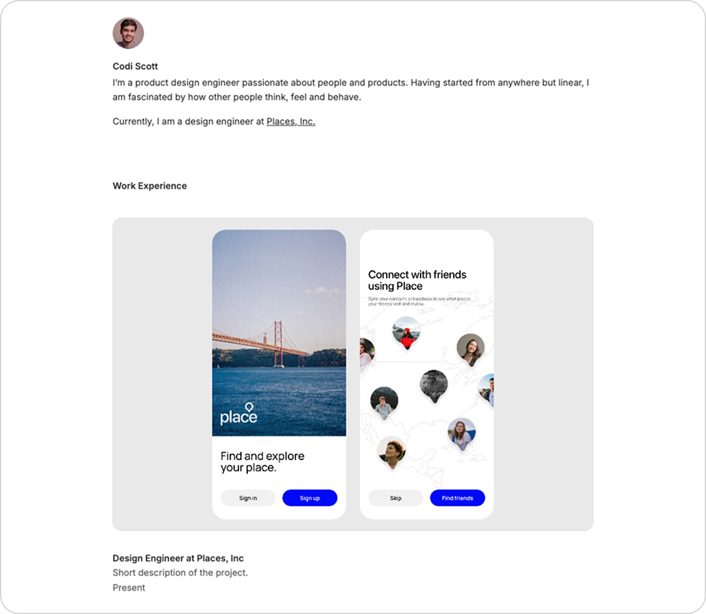

# Simple Portfolio Template



A lightweight, open-source HTML/CSS/JS template for developers and designers just starting out who need a professional, free site to showcase their work.

**TL;DR**  
I made this template so you can get a decent portfolio up and running in minutes. It’s fully open source—use it, hack it, host it, and make it your own!

## Features

- Clean, responsive layout
- Hero section with customizable profile photo and bio
- Work Experience / Vertical grid
- Contact section
- Simple CSS and vanilla JavaScript (no build tools required)

## Getting Started

1. **Clone or download** this repo:
   ```bash
   git clone https://github.com/armondschneider/simpleportfoliosite.git
   simpleportfoliosite
   ```
2. **Add your own content**  
   - Replace `images/profile.jpg` with your photo (keep the same file name or update the `` src in `index.html`).  
   - Swap out project screenshots in `images/` and update the `` tags in the Work Experience section.  
   - Edit the `<h1>` and `.bio` text in `index.html` to your name and tagline.  
   - Change `mailto:` link in the Contact section to your email.
3. **Customize styles**  
   - Update `css/style.css` to tweak colors, fonts, spacing, or add your own components.  
   - Optionally adjust animations in `js/main.js`  add the blur‑fade if you want it.
4. **Preview locally**  
   - Open `index.html` in your browser to see your site in action.
5. **Deploy**  
   - Host on GitHub Pages, Netlify, Vercel, or any static‑site host—just point to your `index.html`.

## Contributing

Feel free to file issues or fork this repo to add new sections, themes, or fancy JS effects.

## License

This template is released under the [MIT License](LICENSE).